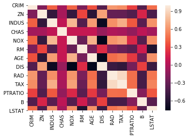

## 序
[AtCorder](https://atcoder.jp/contests/abs/tasks)  
標準入力は


```python:input
a=int(input())#1行の整数
b,c=map(int,input().split())#2つ以上の整数
s=input()#文字列入力
```


- Welcome to AtCoder(入力練習)
- Product(if条件分岐)

<details>
<summary>2問目回答例</summary>

<pre>
前,後=map(int,input().split())
表示=print
数字=前*後
if 数字 % 2 == 0:
    表示('Even')
else:
    表示('Odd')
</pre>

<pre>
a,b=map(int,input().split())
n=a*b
print('EOvdedn'[n%2==1::2])
</pre>

</details>

# numpy

- 配列
- 乱数
- 行列
    - etc


```python
import numpy as np
%precision 3
```


    '%.3f'


```python
data=np.random.randn(2,3)#2行3列の行列を作成
print(data)
```

    [[ 1.108 -1.722  1.078]
     [ 0.004  1.816  1.34 ]]
    


```python
print('この配列のデータ型は{}'.format(data.dtype))
```

    この配列のデータ型はfloat64
    


```python
data_2=np.random.randn(2,3)
data
```


    array([[ 1.108, -1.722,  1.078],
           [ 0.004,  1.816,  1.34 ]])


```python
data>data_2#data_2より大きいdataの場所はTrue
```


    array([[ True, False,  True],
           [ True,  True,  True]])


```python
data[data>=0] #真偽値配列を使って代入
```


    array([1.108, 1.078, 0.004, 1.816, 1.34 ])


```python
data[1][0:2]=12
data
```


    array([[ 1.108, -1.722,  1.078],
           [12.   , 12.   ,  1.34 ]])


numpy arrayはスライスしたものを変更すると
元の配列にも変更が**適用**


```python
data_slice=data[1][0:2]#1行目の0～1番目を抽出
data_slice
```


    array([0., 0.])


```python
data_slice[:]=0
data_slice
```


    array([0., 0.])


```python
data
```


    array([[ 0.051,  0.78 ,  0.022],
           [ 0.   ,  0.   , -1.396]])


```python
arr=np.random.randn(5,4)
arr
```


    array([[ 1.768, -0.321,  0.701,  0.525],
           [-0.28 ,  0.449, -0.217, -1.384],
           [ 0.222, -1.546,  0.022, -1.501],
           [ 0.91 , -0.126,  0.12 ,  0.347],
           [-0.403,  0.226, -0.764,  0.432]])


```python
arr.mean()
```


    -0.04098248562237104


```python
np.mean(arr)
```


    -0.04098248562237104


```python
arr.sum()
```


    -0.8196497124474209


```python
arr.mean(axis=1)#行ごとの平均
```


    array([ 0.668, -0.358, -0.7  ,  0.313, -0.127])


```python
arr.mean(axis=0)#列ごとの平均
```


    array([ 0.443, -0.263, -0.028, -0.316])


```python
(arr>0).sum()#0より大きいものの総和
```


    11

```python
bird=['🥚','🐤']
np.sort(bird)
```


    array(['🐤','🥚'],dtype='<U1'>)


# Scipy


```python
from scipy import stats
import matplotlib.pyplot as plt
%matplotlib inline
```


```python
正規分布=stats.norm.rvs(loc=0,scale=1,size=100,random_state=0)
"""
期待値:0
標準偏差:1
個数:100
"""
plt.hist(正規分布,bins=10,alpha=0.2,ec='blue')
plt.show()
```


# pandas


```python
import pandas as pd
import seaborn as sns
```

`
pandas:データ加工
matplotlib,seaborn:データ可視化
`

今回は~~入力がめんどいので~~seabornでサンプルデータをダウンロード


```python
df=sns.load_dataset('iris')
df.head()#最初の5行を表示
```


<div>
<style scoped>
    .dataframe tbody tr th:only-of-type {
        vertical-align: middle;
    }

    .dataframe tbody tr th {
        vertical-align: top;
    }

    .dataframe thead th {
        text-align: right;
    }
</style>
<table border="1" class="dataframe">
  <thead>
    <tr style="text-align: right;">
      <th></th>
      <th>sepal_length</th>
      <th>sepal_width</th>
      <th>petal_length</th>
      <th>petal_width</th>
      <th>species</th>
    </tr>
  </thead>
  <tbody>
    <tr>
      <td>0</td>
      <td>5.1</td>
      <td>3.5</td>
      <td>1.4</td>
      <td>0.2</td>
      <td>setosa</td>
    </tr>
    <tr>
      <td>1</td>
      <td>4.9</td>
      <td>3.0</td>
      <td>1.4</td>
      <td>0.2</td>
      <td>setosa</td>
    </tr>
    <tr>
      <td>2</td>
      <td>4.7</td>
      <td>3.2</td>
      <td>1.3</td>
      <td>0.2</td>
      <td>setosa</td>
    </tr>
    <tr>
      <td>3</td>
      <td>4.6</td>
      <td>3.1</td>
      <td>1.5</td>
      <td>0.2</td>
      <td>setosa</td>
    </tr>
    <tr>
      <td>4</td>
      <td>5.0</td>
      <td>3.6</td>
      <td>1.4</td>
      <td>0.2</td>
      <td>setosa</td>
    </tr>
  </tbody>
</table>
</div>


|columns||what|
|:-:||:-:|
|sepal length||ガクの長さ|
|sepal wigth||ガクの幅|
|patal length||花弁の長さ|
|patal width||花弁の幅|

irisのほかにも

- planets
- tips
- titanic
- car_craches
    - etc

**sns.get_dataset_names()**  
で見れます

~~sklearn にもあります~~


```python
from sklearn.datasets import load_boston
boston=load_boston()
df_boston=pd.DataFrame(boston.data,columns=boston.feature_names).assign(MEDV=np.array(boston.target))
df_boston.head()
```


<div>
<style scoped>
    .dataframe tbody tr th:only-of-type {
        vertical-align: middle;
    }

    .dataframe tbody tr th {
        vertical-align: top;
    }

    .dataframe thead th {
        text-align: right;
    }
</style>
<table border="1" class="dataframe">
  <thead>
    <tr style="text-align: right;">
      <th></th>
      <th>CRIM</th>
      <th>ZN</th>
      <th>INDUS</th>
      <th>CHAS</th>
      <th>NOX</th>
      <th>RM</th>
      <th>AGE</th>
      <th>DIS</th>
      <th>RAD</th>
      <th>TAX</th>
      <th>PTRATIO</th>
      <th>B</th>
      <th>LSTAT</th>
      <th>MEDV</th>
    </tr>
  </thead>
  <tbody>
    <tr>
      <td>0</td>
      <td>0.00632</td>
      <td>18.0</td>
      <td>2.31</td>
      <td>0.0</td>
      <td>0.538</td>
      <td>6.575</td>
      <td>65.2</td>
      <td>4.0900</td>
      <td>1.0</td>
      <td>296.0</td>
      <td>15.3</td>
      <td>396.90</td>
      <td>4.98</td>
      <td>24.0</td>
    </tr>
    <tr>
      <td>1</td>
      <td>0.02731</td>
      <td>0.0</td>
      <td>7.07</td>
      <td>0.0</td>
      <td>0.469</td>
      <td>6.421</td>
      <td>78.9</td>
      <td>4.9671</td>
      <td>2.0</td>
      <td>242.0</td>
      <td>17.8</td>
      <td>396.90</td>
      <td>9.14</td>
      <td>21.6</td>
    </tr>
    <tr>
      <td>2</td>
      <td>0.02729</td>
      <td>0.0</td>
      <td>7.07</td>
      <td>0.0</td>
      <td>0.469</td>
      <td>7.185</td>
      <td>61.1</td>
      <td>4.9671</td>
      <td>2.0</td>
      <td>242.0</td>
      <td>17.8</td>
      <td>392.83</td>
      <td>4.03</td>
      <td>34.7</td>
    </tr>
    <tr>
      <td>3</td>
      <td>0.03237</td>
      <td>0.0</td>
      <td>2.18</td>
      <td>0.0</td>
      <td>0.458</td>
      <td>6.998</td>
      <td>45.8</td>
      <td>6.0622</td>
      <td>3.0</td>
      <td>222.0</td>
      <td>18.7</td>
      <td>394.63</td>
      <td>2.94</td>
      <td>33.4</td>
    </tr>
    <tr>
      <td>4</td>
      <td>0.06905</td>
      <td>0.0</td>
      <td>2.18</td>
      <td>0.0</td>
      <td>0.458</td>
      <td>7.147</td>
      <td>54.2</td>
      <td>6.0622</td>
      <td>3.0</td>
      <td>222.0</td>
      <td>18.7</td>
      <td>396.90</td>
      <td>5.33</td>
      <td>36.2</td>
    </tr>
  </tbody>
</table>
</div>


```python
df_boston.describe()
```


<div>
<style scoped>
    .dataframe tbody tr th:only-of-type {
        vertical-align: middle;
    }

    .dataframe tbody tr th {
        vertical-align: top;
    }

    .dataframe thead th {
        text-align: right;
    }
</style>
<table border="1" class="dataframe">
  <thead>
    <tr style="text-align: right;">
      <th></th>
      <th>CRIM</th>
      <th>ZN</th>
      <th>INDUS</th>
      <th>CHAS</th>
      <th>NOX</th>
      <th>RM</th>
      <th>AGE</th>
      <th>DIS</th>
      <th>RAD</th>
      <th>TAX</th>
      <th>PTRATIO</th>
      <th>B</th>
      <th>LSTAT</th>
      <th>MEDV</th>
    </tr>
  </thead>
  <tbody>
    <tr>
      <td>count</td>
      <td>506.000000</td>
      <td>506.000000</td>
      <td>506.000000</td>
      <td>506.000000</td>
      <td>506.000000</td>
      <td>506.000000</td>
      <td>506.000000</td>
      <td>506.000000</td>
      <td>506.000000</td>
      <td>506.000000</td>
      <td>506.000000</td>
      <td>506.000000</td>
      <td>506.000000</td>
      <td>506.000000</td>
    </tr>
    <tr>
      <td>mean</td>
      <td>3.613524</td>
      <td>11.363636</td>
      <td>11.136779</td>
      <td>0.069170</td>
      <td>0.554695</td>
      <td>6.284634</td>
      <td>68.574901</td>
      <td>3.795043</td>
      <td>9.549407</td>
      <td>408.237154</td>
      <td>18.455534</td>
      <td>356.674032</td>
      <td>12.653063</td>
      <td>22.532806</td>
    </tr>
    <tr>
      <td>std</td>
      <td>8.601545</td>
      <td>23.322453</td>
      <td>6.860353</td>
      <td>0.253994</td>
      <td>0.115878</td>
      <td>0.702617</td>
      <td>28.148861</td>
      <td>2.105710</td>
      <td>8.707259</td>
      <td>168.537116</td>
      <td>2.164946</td>
      <td>91.294864</td>
      <td>7.141062</td>
      <td>9.197104</td>
    </tr>
    <tr>
      <td>min</td>
      <td>0.006320</td>
      <td>0.000000</td>
      <td>0.460000</td>
      <td>0.000000</td>
      <td>0.385000</td>
      <td>3.561000</td>
      <td>2.900000</td>
      <td>1.129600</td>
      <td>1.000000</td>
      <td>187.000000</td>
      <td>12.600000</td>
      <td>0.320000</td>
      <td>1.730000</td>
      <td>5.000000</td>
    </tr>
    <tr>
      <td>25%</td>
      <td>0.082045</td>
      <td>0.000000</td>
      <td>5.190000</td>
      <td>0.000000</td>
      <td>0.449000</td>
      <td>5.885500</td>
      <td>45.025000</td>
      <td>2.100175</td>
      <td>4.000000</td>
      <td>279.000000</td>
      <td>17.400000</td>
      <td>375.377500</td>
      <td>6.950000</td>
      <td>17.025000</td>
    </tr>
    <tr>
      <td>50%</td>
      <td>0.256510</td>
      <td>0.000000</td>
      <td>9.690000</td>
      <td>0.000000</td>
      <td>0.538000</td>
      <td>6.208500</td>
      <td>77.500000</td>
      <td>3.207450</td>
      <td>5.000000</td>
      <td>330.000000</td>
      <td>19.050000</td>
      <td>391.440000</td>
      <td>11.360000</td>
      <td>21.200000</td>
    </tr>
    <tr>
      <td>75%</td>
      <td>3.677083</td>
      <td>12.500000</td>
      <td>18.100000</td>
      <td>0.000000</td>
      <td>0.624000</td>
      <td>6.623500</td>
      <td>94.075000</td>
      <td>5.188425</td>
      <td>24.000000</td>
      <td>666.000000</td>
      <td>20.200000</td>
      <td>396.225000</td>
      <td>16.955000</td>
      <td>25.000000</td>
    </tr>
    <tr>
      <td>max</td>
      <td>88.976200</td>
      <td>100.000000</td>
      <td>27.740000</td>
      <td>1.000000</td>
      <td>0.871000</td>
      <td>8.780000</td>
      <td>100.000000</td>
      <td>12.126500</td>
      <td>24.000000</td>
      <td>711.000000</td>
      <td>22.000000</td>
      <td>396.900000</td>
      <td>37.970000</td>
      <td>50.000000</td>
    </tr>
  </tbody>
</table>
</div>


```python
df.sepal_length
```


    0      5.1
    1      4.9
    2      4.7
    3      4.6
    4      5.0
          ... 
    145    6.7
    146    6.3
    147    6.5
    148    6.2
    149    5.9
    Name: sepal_length, Length: 150, dtype: float64


```python
df[df['sepal_length']>5].head()
#sepal_lengthが5より大きい
```


<div>
<style scoped>
    .dataframe tbody tr th:only-of-type {
        vertical-align: middle;
    }

    .dataframe tbody tr th {
        vertical-align: top;
    }

    .dataframe thead th {
        text-align: right;
    }
</style>
<table border="1" class="dataframe">
  <thead>
    <tr style="text-align: right;">
      <th></th>
      <th>sepal_length</th>
      <th>sepal_width</th>
      <th>petal_length</th>
      <th>petal_width</th>
      <th>species</th>
    </tr>
  </thead>
  <tbody>
    <tr>
      <td>0</td>
      <td>5.1</td>
      <td>3.5</td>
      <td>1.4</td>
      <td>0.2</td>
      <td>setosa</td>
    </tr>
    <tr>
      <td>5</td>
      <td>5.4</td>
      <td>3.9</td>
      <td>1.7</td>
      <td>0.4</td>
      <td>setosa</td>
    </tr>
    <tr>
      <td>10</td>
      <td>5.4</td>
      <td>3.7</td>
      <td>1.5</td>
      <td>0.2</td>
      <td>setosa</td>
    </tr>
    <tr>
      <td>14</td>
      <td>5.8</td>
      <td>4.0</td>
      <td>1.2</td>
      <td>0.2</td>
      <td>setosa</td>
    </tr>
    <tr>
      <td>15</td>
      <td>5.7</td>
      <td>4.4</td>
      <td>1.5</td>
      <td>0.4</td>
      <td>setosa</td>
    </tr>
  </tbody>
</table>
</div>


```python
df.sort_values('sepal_width')
```


<div>
<style scoped>
    .dataframe tbody tr th:only-of-type {
        vertical-align: middle;
    }

    .dataframe tbody tr th {
        vertical-align: top;
    }

    .dataframe thead th {
        text-align: right;
    }
</style>
<table border="1" class="dataframe">
  <thead>
    <tr style="text-align: right;">
      <th></th>
      <th>sepal_length</th>
      <th>sepal_width</th>
      <th>petal_length</th>
      <th>petal_width</th>
      <th>species</th>
    </tr>
  </thead>
  <tbody>
    <tr>
      <td>60</td>
      <td>5.0</td>
      <td>2.0</td>
      <td>3.5</td>
      <td>1.0</td>
      <td>versicolor</td>
    </tr>
    <tr>
      <td>62</td>
      <td>6.0</td>
      <td>2.2</td>
      <td>4.0</td>
      <td>1.0</td>
      <td>versicolor</td>
    </tr>
    <tr>
      <td>119</td>
      <td>6.0</td>
      <td>2.2</td>
      <td>5.0</td>
      <td>1.5</td>
      <td>virginica</td>
    </tr>
    <tr>
      <td>68</td>
      <td>6.2</td>
      <td>2.2</td>
      <td>4.5</td>
      <td>1.5</td>
      <td>versicolor</td>
    </tr>
    <tr>
      <td>41</td>
      <td>4.5</td>
      <td>2.3</td>
      <td>1.3</td>
      <td>0.3</td>
      <td>setosa</td>
    </tr>
    <tr>
      <td>...</td>
      <td>...</td>
      <td>...</td>
      <td>...</td>
      <td>...</td>
      <td>...</td>
    </tr>
    <tr>
      <td>16</td>
      <td>5.4</td>
      <td>3.9</td>
      <td>1.3</td>
      <td>0.4</td>
      <td>setosa</td>
    </tr>
    <tr>
      <td>14</td>
      <td>5.8</td>
      <td>4.0</td>
      <td>1.2</td>
      <td>0.2</td>
      <td>setosa</td>
    </tr>
    <tr>
      <td>32</td>
      <td>5.2</td>
      <td>4.1</td>
      <td>1.5</td>
      <td>0.1</td>
      <td>setosa</td>
    </tr>
    <tr>
      <td>33</td>
      <td>5.5</td>
      <td>4.2</td>
      <td>1.4</td>
      <td>0.2</td>
      <td>setosa</td>
    </tr>
    <tr>
      <td>15</td>
      <td>5.7</td>
      <td>4.4</td>
      <td>1.5</td>
      <td>0.4</td>
      <td>setosa</td>
    </tr>
  </tbody>
</table>
<p>150 rows × 5 columns</p>
</div>


```python
df.describe()#検定統計量
```


<div>
<style scoped>
    .dataframe tbody tr th:only-of-type {
        vertical-align: middle;
    }

    .dataframe tbody tr th {
        vertical-align: top;
    }

    .dataframe thead th {
        text-align: right;
    }
</style>
<table border="1" class="dataframe">
  <thead>
    <tr style="text-align: right;">
      <th></th>
      <th>sepal_length</th>
      <th>sepal_width</th>
      <th>petal_length</th>
      <th>petal_width</th>
    </tr>
  </thead>
  <tbody>
    <tr>
      <td>count</td>
      <td>150.000000</td>
      <td>150.000000</td>
      <td>150.000000</td>
      <td>150.000000</td>
    </tr>
    <tr>
      <td>mean</td>
      <td>5.843333</td>
      <td>3.057333</td>
      <td>3.758000</td>
      <td>1.199333</td>
    </tr>
    <tr>
      <td>std</td>
      <td>0.828066</td>
      <td>0.435866</td>
      <td>1.765298</td>
      <td>0.762238</td>
    </tr>
    <tr>
      <td>min</td>
      <td>4.300000</td>
      <td>2.000000</td>
      <td>1.000000</td>
      <td>0.100000</td>
    </tr>
    <tr>
      <td>25%</td>
      <td>5.100000</td>
      <td>2.800000</td>
      <td>1.600000</td>
      <td>0.300000</td>
    </tr>
    <tr>
      <td>50%</td>
      <td>5.800000</td>
      <td>3.000000</td>
      <td>4.350000</td>
      <td>1.300000</td>
    </tr>
    <tr>
      <td>75%</td>
      <td>6.400000</td>
      <td>3.300000</td>
      <td>5.100000</td>
      <td>1.800000</td>
    </tr>
    <tr>
      <td>max</td>
      <td>7.900000</td>
      <td>4.400000</td>
      <td>6.900000</td>
      <td>2.500000</td>
    </tr>
  </tbody>
</table>
</div>


```python
df.isnull().sum()#欠損値(nan)の判定
```


    sepal_length    0
    sepal_width     0
    petal_length    0
    petal_width     0
    species         0
    dtype: int64


欠損値は
- nan
- not a number
- NA(Not Available)
とか言われる

*Matplotlib*  
dfを図にします


たくさん機能があるのでこんなグラフにしたいみたいなものがあれば
ググってください


```python
import matplotlib.pyplot as plt
import seaborn as sns
%matplotlib inline
```


```python
sns.pairplot(df,plot_kws={'alpha':0.2});
```


## irisデータの散布図行列
 各plot関数にはいろんな引数があります(共通するものが多い)
 ~~覚えるより調べたほうが早いときもある~~
 
 **以下pairplotの例**
 


```python
sns.pairplot(df, hue='species')
```


    <seaborn.axisgrid.PairGrid at 0x1e3604a6588>


```python
sns.pairplot(df, hue='species', palette='Reds')
```


    <seaborn.axisgrid.PairGrid at 0x1e3618c59c8>


- hue
データフレームのカテゴリ別に色分けしてくれる
- palette
色を変えれます


```python
sns.pairplot(df, hue='species',
             vars=['sepal_length', 'sepal_width']);
```


- vars
varsで欲しいところだけ


```python
sns.pairplot(df, hue='species', kind='reg')
```


    <seaborn.axisgrid.PairGrid at 0x1e3618cee48>


- kind='reg'  
回帰直線(regression)が重ねて表示される


```python
sns.pairplot(df, hue='species', diag_kind='kde')
```


    <seaborn.axisgrid.PairGrid at 0x1e364d75808>


ほかにも
- ヒストグラム
    - hist
    - barplot
    - bar(縦)
    - barh(横)
- 折れ線
    - plot  
    - etc


```python
from numpy.random import randn
plt.plot(randn(30).cumsum(),'ko--',marker='+');
```


ランダムな30個の数値の累積和の折れ線  

- ko--
    - 点線表示
- marker='o'
    - 点を変えれます
    - 'x', '+' . etc.


```python
df_boston.head()
```


<div>
<style scoped>
    .dataframe tbody tr th:only-of-type {
        vertical-align: middle;
    }

    .dataframe tbody tr th {
        vertical-align: top;
    }

    .dataframe thead th {
        text-align: right;
    }
</style>
<table border="1" class="dataframe">
  <thead>
    <tr style="text-align: right;">
      <th></th>
      <th>CRIM</th>
      <th>ZN</th>
      <th>INDUS</th>
      <th>CHAS</th>
      <th>NOX</th>
      <th>RM</th>
      <th>AGE</th>
      <th>DIS</th>
      <th>RAD</th>
      <th>TAX</th>
      <th>PTRATIO</th>
      <th>B</th>
      <th>LSTAT</th>
      <th>MEDV</th>
    </tr>
  </thead>
  <tbody>
    <tr>
      <td>0</td>
      <td>0.00632</td>
      <td>18.0</td>
      <td>2.31</td>
      <td>0.0</td>
      <td>0.538</td>
      <td>6.575</td>
      <td>65.2</td>
      <td>4.0900</td>
      <td>1.0</td>
      <td>296.0</td>
      <td>15.3</td>
      <td>396.90</td>
      <td>4.98</td>
      <td>24.0</td>
    </tr>
    <tr>
      <td>1</td>
      <td>0.02731</td>
      <td>0.0</td>
      <td>7.07</td>
      <td>0.0</td>
      <td>0.469</td>
      <td>6.421</td>
      <td>78.9</td>
      <td>4.9671</td>
      <td>2.0</td>
      <td>242.0</td>
      <td>17.8</td>
      <td>396.90</td>
      <td>9.14</td>
      <td>21.6</td>
    </tr>
    <tr>
      <td>2</td>
      <td>0.02729</td>
      <td>0.0</td>
      <td>7.07</td>
      <td>0.0</td>
      <td>0.469</td>
      <td>7.185</td>
      <td>61.1</td>
      <td>4.9671</td>
      <td>2.0</td>
      <td>242.0</td>
      <td>17.8</td>
      <td>392.83</td>
      <td>4.03</td>
      <td>34.7</td>
    </tr>
    <tr>
      <td>3</td>
      <td>0.03237</td>
      <td>0.0</td>
      <td>2.18</td>
      <td>0.0</td>
      <td>0.458</td>
      <td>6.998</td>
      <td>45.8</td>
      <td>6.0622</td>
      <td>3.0</td>
      <td>222.0</td>
      <td>18.7</td>
      <td>394.63</td>
      <td>2.94</td>
      <td>33.4</td>
    </tr>
    <tr>
      <td>4</td>
      <td>0.06905</td>
      <td>0.0</td>
      <td>2.18</td>
      <td>0.0</td>
      <td>0.458</td>
      <td>7.147</td>
      <td>54.2</td>
      <td>6.0622</td>
      <td>3.0</td>
      <td>222.0</td>
      <td>18.7</td>
      <td>396.90</td>
      <td>5.33</td>
      <td>36.2</td>
    </tr>
  </tbody>
</table>
</div>


```python
sns.countplot('RAD',data=df_boston)
```


    <matplotlib.axes._subplots.AxesSubplot at 0x1e369270148>


```python
sns.heatmap(df_boston.corr())
```


    <matplotlib.axes._subplots.AxesSubplot at 0x1e368c97c48>





```python
sns.catplot(x='RAD',y='MEDV',data=df_boston,kind='box')
```


    <seaborn.axisgrid.FacetGrid at 0x1e36b0f62c8>


```python
sns.catplot(x='RAD',y='MEDV',data=df_boston,kind='boxen')
```


    <seaborn.axisgrid.FacetGrid at 0x1e36b14b0c8>


```python
sns.catplot(x='RAD',y='MEDV',data=df_boston,kind='swarm')
```


    <seaborn.axisgrid.FacetGrid at 0x1e36b2c0f08>


```python
sns.jointplot(x='RAD',y='MEDV',data=df_boston,kind='hex')
```


    <seaborn.axisgrid.JointGrid at 0x1e36c4e30c8>


```python

```
